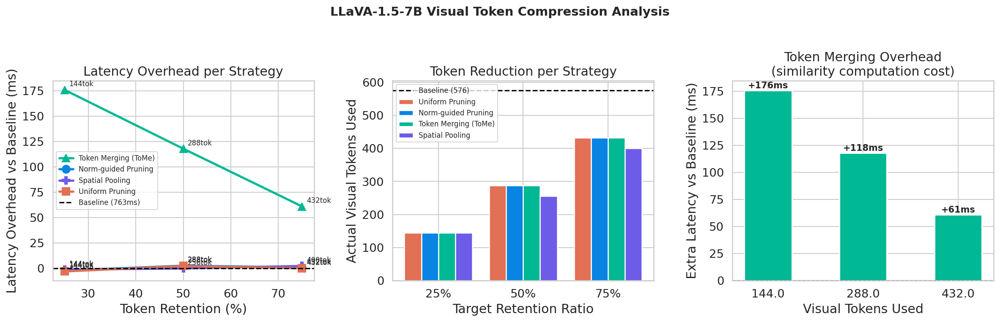
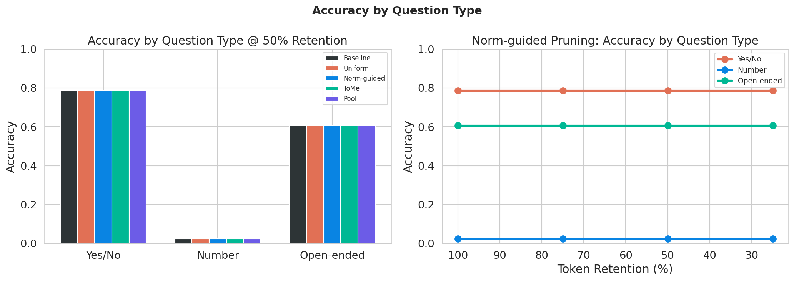
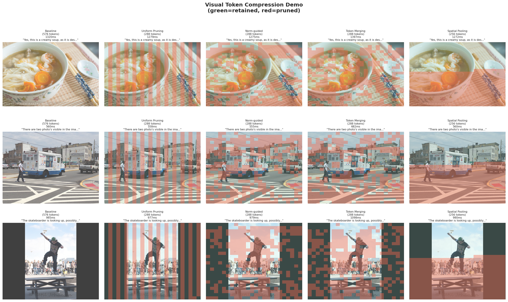

# Visual Token Compression for Efficient VLM Inference

**26Spring HPML Course Project — Zhuoao Wang**

---

## 1. Project Description

Modern VLMs such as LLaVA-1.5 encode a single image into **576 visual tokens**, all passed through every layer of the LLM, creating significant overhead even when many tokens are redundant.

This project evaluates **four training-free visual token compression strategies** applied at inference time without fine-tuning:

| Strategy | Description |
|----------|-------------|
| **Uniform Pruning** | Drop tokens at fixed intervals — no semantic signal |
| **Norm-guided Pruning** | Retain tokens with highest L2 norm in hidden states |
| **Token Merging (ToMe)** | Merge similar tokens via cosine similarity matching |
| **Spatial Pooling** | Average pool over the 24×24 spatial token grid |

**Key Finding:** Post-prefill token compression preserves VQA accuracy completely across all strategies and compression ratios (75%, 50%, 25%). However, it does not reduce prefill latency because the main computational cost occurs during the prefill forward pass. Token Merging (ToMe) incurs additional overhead due to pairwise similarity computation. This finding motivates future work on mid-layer compression integrated directly into the model forward pass.

**Model:** LLaVA-1.5-7B (float16, ~14GB VRAM)  
**Dataset:** VQAv2 validation split (1000 samples)  
**Hardware:** NVIDIA A100-SXM4-40GB (Google Colab Pro)

---

## 2. Project Milestones and Completion Status

| Milestone | Status |
|-----------|--------|
| Environment setup (LLaVA + dependencies) | ✅ Complete |
| Dataset loading (VQAv2 1000 samples) | ✅ Complete |
| Model loading (LLaVA-1.5-7B float16) | ✅ Complete |
| Implement 4 compression strategies | ✅ Complete |
| Baseline experiment (1000 samples) | ✅ Complete |
| Full experiment matrix (13 groups) | ✅ Complete |
| Results visualization | ✅ Complete |
| Fine-grained analysis by question type | ✅ Complete |
| Demo with token grid visualization | ✅ Complete |
| Attention-guided pruning via attention weights | ❌ Not completed — LLaVA's attention layers do not output attention weights by default under torch 2.x + Python 3.12; replaced with norm-guided pruning |
| Mid-layer compression (pruning inside prefill) | ❌ Not completed — compression hook fires after the full prefill forward pass; requires modifying LLaVA's internal forward logic |
| Ablation on pruning layer position | ❌ Not completed — deprioritized after discovering post-prefill compression does not reduce latency regardless of layer choice |
| Number question evaluation fix | ❌ Not completed — numeric normalization fix implemented but experiments not re-run due to time constraints |

---

## 3. Repository Structure

```
.
├── notebooks/
│   ├── HPML_VToken_Compression_v1.ipynb        # Version 1
│   ├── HPML_VToken_Compression_v2.ipynb        # Version 2
│   ├── HPML_VToken_Compression_v3.ipynb        # Version 3
│   ├── HPML_VToken_Compression_v4.ipynb        # Version 4
│   ├── HPML_VToken_Compression_v5.ipynb        # Version 5 - full version (includes debugging)
├── HPML_VToken_Compression_v6.ipynb            # Final version (final)
├── results.csv                                 # Experiment results (13 groups)
├── results_analysis.png                        # Latency overhead analysis
├── results_by_type.png                         # Accuracy by question type
├── demo_full_fixed.png                         # Visual token compression demo
└── README.md
```

**Notebook structure:**

| Section | Content |
|---------|---------|
| 0 | Environment setup + dependency installation |
| 1 | VQAv2 dataset loading |
| 2 | LLaVA-1.5-7B model loading |
| 3 | Compression strategy definitions |
| 4 | Inference + benchmark runner functions |
| 5 | Run all experiments |
| 6 | Results visualization |
| 7 | Demo with token grid overlay |

---

## 4. Example Commands to Execute the Code

**Running Environment:**
- **Platform:** Google Colab Pro
- **GPU:** NVIDIA A100-SXM4-40GB (42.4 GB VRAM)
- **Runtime:** 2026.04 (Python 3.12, PyTorch 2.10.0+cu128, CUDA 12.8)
- **Google Drive:** Required for caching model weights (~14GB) and VQAv2 dataset (~6GB)

**Step 1: Install dependencies (Cell 0-1)**
```python
!pip install -q transformers==4.37.2 accelerate==0.21.0 bitsandbytes
!pip install -q sentencepiece==0.1.99 einops==0.6.1 einops-exts==0.0.4
!pip install -q timm==0.6.13 markdown2 shortuuid Pillow matplotlib pandas seaborn
!pip install -q -U datasets
!pip install -q --no-deps git+https://github.com/haotian-liu/LLaVA.git
```
After Cell 0-1, do **Runtime > Restart Runtime**, then continue from Cell 0-2.

**Step 2: Run a single inference**
```python
pred, latency, vram, n_tokens, kept_idx = run_inference_single(
    sample=samples[0],
    strategy_fn=norm_prune,
    keep_ratio=0.5
)
print(f"Answer: {pred}, Tokens used: {n_tokens}/576, Latency: {latency:.0f}ms")
```

**Step 3: Run full experiment matrix**
```python
for strategy in ['baseline', 'uniform', 'norm', 'merge', 'pool']:
    ratios = [1.0] if strategy == 'baseline' else [0.75, 0.50, 0.25]
    for ratio in ratios:
        r = run_experiment(strategy, ratio)
        results.append(r)
        pd.DataFrame(results).to_csv(RESULTS_PATH, index=False)
```

**Note:** Flash attention must be disabled for LLaVA to work on PyTorch 2.x + Python 3.12:
```python
torch.backends.cuda.enable_flash_sdp(False)
torch.backends.cuda.enable_mem_efficient_sdp(False)
torch.backends.cuda.enable_math_sdp(True)
```

---

## 5. Results and Observations

### Experiment Results

| Strategy | Retention | Tokens Used | Accuracy | Latency (ms) |
|----------|-----------|-------------|----------|--------------|
| Baseline | 100% | 576 | 0.609 | 763 |
| Uniform | 75% | 432 | 0.609 | 763 |
| Uniform | 50% | 288 | 0.609 | 765 |
| Uniform | 25% | 144 | 0.609 | 760 |
| Norm-guided | 75% | 432 | 0.609 | 764 |
| Norm-guided | 50% | 288 | 0.609 | 765 |
| Norm-guided | 25% | 144 | 0.609 | 761 |
| Token Merging | 75% | 432 | 0.609 | 824 |
| Token Merging | 50% | 288 | 0.609 | 881 |
| Token Merging | 25% | 144 | 0.609 | 939 |
| Spatial Pool | 75% | 400 | 0.609 | 765 |
| Spatial Pool | 50% | 256 | 0.609 | 763 |
| Spatial Pool | 25% | 144 | 0.609 | 762 |

### Key Observations

**Observation 1 — Accuracy fully preserved across all strategies and compression ratios.**
All strategies maintain 0.609 VQA accuracy even at 25% token retention (144 tokens), demonstrating that a large fraction of visual tokens are redundant for answering text queries.

**Observation 2 — Post-prefill compression does not reduce latency.**
Compression is applied after the prefill forward pass, so the cost of processing all 576 tokens through 32 LLM layers has already occurred. Latency remains ~763ms regardless of compression ratio for Uniform, Norm-guided, and Spatial Pooling.

**Observation 3 — Token Merging incurs significant overhead.**
Pairwise cosine similarity computation (O(n²)) adds +61ms at 75%, +118ms at 50%, and +176ms at 25% retention, making ToMe slower than baseline at all ratios.

**Observation 4 — Accuracy is consistent across question types.**
Yes/No ~79%, Open-ended ~61%, Number ~3%. Low Number accuracy is a known evaluation limitation — the model outputs English words ("one", "two") while ground truth uses Arabic numerals ("1", "2").

**Observation 5 — Spatial Pooling produces slightly fewer tokens than target.**
At 50% retention, Spatial Pooling produces 256 tokens (16×16 grid) rather than 288, due to integer rounding in 2D pooling.

### Visualizations

**Latency Overhead Analysis:**


**Accuracy by Question Type:**


**Token Compression Demo:**


### Limitations and Future Work

- Compression after prefill does not reduce the main computational bottleneck. Future work should integrate compression into mid-layer forward passes to reduce actual FLOPs.
- Number question evaluation is limited by exact-match scoring. A softer numeric matching strategy would improve reported accuracy.
- Experiments are on a single model (LLaVA-1.5-7B). Generalizing to other VLMs (e.g., Qwen2-VL, InternVL) is an important next step.
